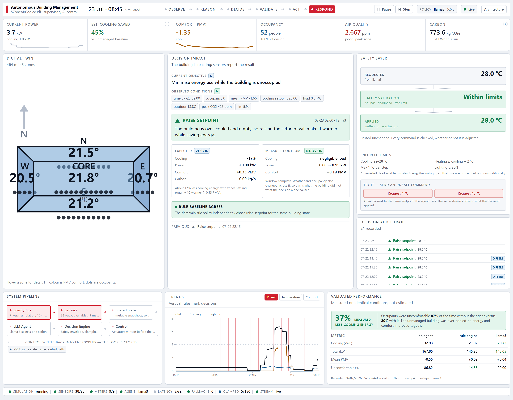
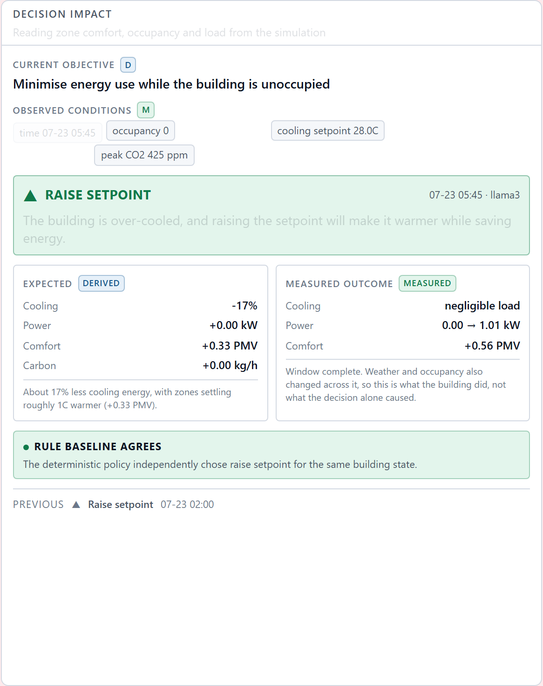
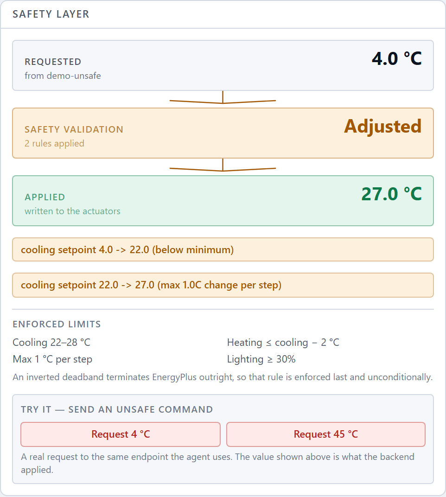
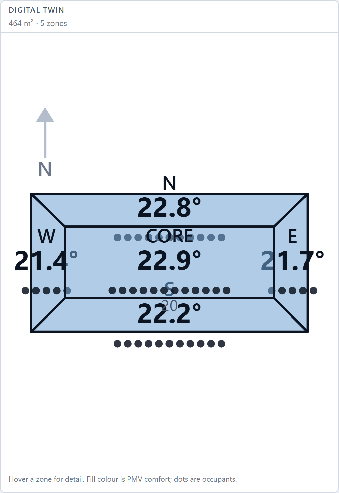
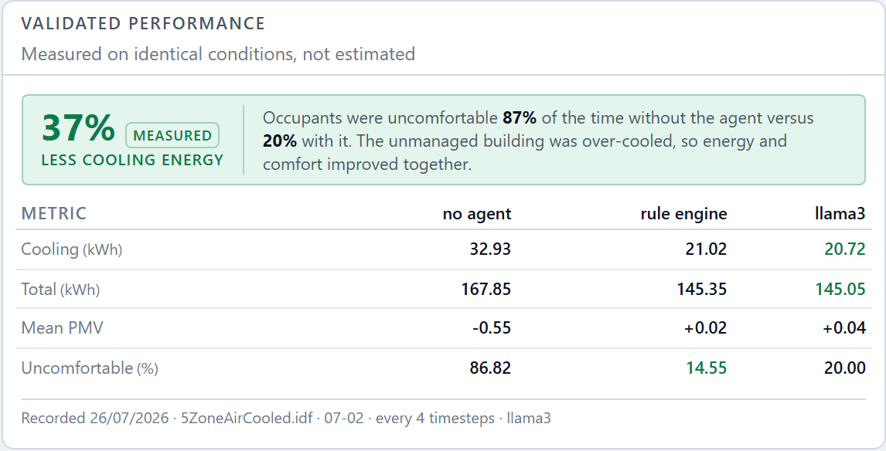

# SynapseBMS — Autonomous Building Management System

An AI agent that reads live sensor data from an EnergyPlus building simulation,
reasons about building state, and writes control decisions back into the running
simulation — closing the loop the way a supervisory BMS layer does.

Measured on identical conditions, the agent cuts cooling energy by **37%** while
reducing time-uncomfortable from **87% to 20%**. Neither number is estimated;
both come from [`scripts/compare_policies.py`](scripts/compare_policies.py),
which runs the same simulated day with and without the agent.



## Quickstart

Requires [EnergyPlus](#prerequisites) and [Ollama](https://ollama.com) with
`llama3`.

```bash
python -m venv .venv && .venv\Scripts\Activate.ps1
python -m pip install -r requirements.txt -r requirements-dev.txt
```

```bash
cd frontend && npm install && npm run build && cd ..
```

```bash
python scripts/run_server.py --policy llm --speed 0.4 --decide-every 12
```

Open <http://localhost:8000>. One process serves the simulation, the agent, the
API and the dashboard.

## Architecture

```
EnergyPlus ──► Sensor Collector ──► State Store ──► MCP Server ──► LLM Agent
(own thread)                            ▲                              │
     ▲                                  │                              ▼
     └──── Control Layer ◄── Control State ◄──────────── Decision Engine
                                        │
                              FastAPI ──┴──► WebSocket ──► React Dashboard
```

The simulation advances in milliseconds; the agent reasons in seconds. They are
decoupled through an immutable state snapshot, so the simulation applies the last
known-good command every timestep and keeps running safely even if the agent
stalls or fails. Every command is clamped to a comfort/safety band by the
Decision Engine before it reaches an actuator.

## Prerequisites

**EnergyPlus** — install from the
[releases page](https://github.com/NatLabRockies/EnergyPlus/releases) using the
`Windows-x86_64.exe` installer and the default install path. `pyenergyplus` ships
inside that install rather than on PyPI, which is why it is absent from
`requirements.txt`; `backend/config/paths.py` locates it at runtime.

A non-default install location is supported via the `ENERGYPLUS_DIR` environment
variable.

**Python 3.10+, 64-bit.** The API is loaded through ctypes, so the Python version
does not need to match EnergyPlus, but the architecture does.

**Ollama** with Llama 3 — required from the agent module onward.

## Setup

```bash
python -m venv .venv
.venv\Scripts\Activate.ps1
python -m pip install -r requirements.txt -r requirements-dev.txt
```

## Verify the environment

Run these in order. Each one gates the next.

```bash
python scripts/verify_energyplus.py --run   # can we get in-run callbacks?
python scripts/prepare_model.py             # copy the building model into models/
python scripts/inspect_model.py             # which sensors does the model expose?
```

`verify_energyplus.py` must report a non-zero callback count — that is the proof
that closed-loop control is possible at all. `inspect_model.py` writes
`docs/available_sensors.json`, which is the contract the sensor layer is built
against.

## Run the simulation

```bash
python scripts/run_simulation.py --speed 0.12 --seconds 45
```

Live sensor data should stream with contiguous sequence numbers, occupancy
rising to 52 at 08:00 and whole-building power following it.

### Why an annual run period, not design days

Design days are *sizing* scenarios: their schedules deliberately zero out
occupancy so equipment is sized for the worst case. That produces an empty
building with flat energy use — nothing for an agent to reason about. The annual
run period carries real weather and real occupancy schedules instead.

An unthrottled annual run reaches December in about 11 seconds, so the engine
fast-forwards at full speed to a chosen date (`--from-date`) and only then drops
to demo pace.

### Derived metrics

Two dashboard metrics are computed rather than read, because this model does not
produce them:

| Metric | Source |
| --- | --- |
| CO₂ / air quality | Steady-state mass balance from occupant count and mechanical ventilation mass flow |
| PMV comfort | Fanger model from zone temperature and relative humidity |

This model exposes no `Electricity:Facility` meter, so whole-building
electricity is derived. EnergyPlus meters electricity on two independent axes
and mixing them double-counts:

| Axis | Meters | Use |
| --- | --- | --- |
| System category (disjoint) | `Electricity:Building` + `Electricity:HVAC` + `Electricity:Plant` | Totalling |
| End use (disjoint) | Lights, Equipment, Fans, Cooling, Pumps | Attribution |

`Electricity:Plant` matters: this model cools through a chilled-water loop, so
the chiller and its pumps are metered under Plant rather than HVAC. Omitting it
hides the very energy the agent controls.

## Verify the control loop

```bash
python scripts/verify_control.py
```

Runs the same summer day twice, with and without a setpoint command, and reports
the difference. Expect roughly 30% cooling energy saved for a 2.1 °C setpoint
increase, at the cost of about 2 °C higher peak indoor temperature.

### Safety

The agent never writes to an actuator. Commands pass through `ControlStore`,
which clamps them at the boundary closest to the effect — the last component
before the actuator owns the invariant, because a limit enforced upstream can be
defeated by any bug downstream of it.

| Rule | Why |
| --- | --- |
| Cooling 22–28 °C, heating 16–20 °C | Comfort envelope |
| Heating ≤ cooling − 2 °C | **EnergyPlus terminates** on an inverted deadband, so a bad setpoint would end the demo |
| Max 1.0 °C change per timestep | Prevents HVAC surges and damps agent oscillation |
| Lighting ≥ 30% | Egress safety |
| No command → actuators released | Fail-safe: the building runs its own schedule |

Control state is sticky: an unset field means "leave this channel alone", not
"revert it". Only the absence of a command releases the actuators, so a decision
to hold does not hand the building back to its own schedule.

## Run autonomously

```bash
python scripts/run_autonomous.py --speed 0.05 --seconds 60
```

Simulation, comfort processing, decision policy and control running together
with no LLM. The agent sets back overnight, protects per-zone comfort during
occupied hours, and converts comfort headroom into savings.

### Comfort and air quality

PMV (ISO 7730 / ASHRAE 55) places thermal sensation on −3…+3, with ±0.5 as the
comfortable band. The model needs six inputs; this building measures two, and
the rest are explicit assumptions in `ComfortAssumptions` rather than literals
buried in the calculation. At 0.5 clo and 1.1 met the implementation puts
neutral at 25.4 °C, which matches the ASHRAE 55 summer comfort zone.

CO₂ is a steady-state mass balance over occupancy and ventilation mass flow.
It gives the equilibrium concentration, so it does not show the ramp as a room
fills.

### Decision policy

A priority ladder — first rule that applies decides. Ordering encodes intent.

| Priority | Condition | Action |
| --- | --- | --- |
| 1 | Unoccupied | Set back, dim lights |
| 2 | Any occupied zone PMV > +0.5 | Lower setpoint |
| 3 | Any occupied zone PMV < −0.5 | Raise setpoint |
| 4 | Comfortable with headroom | Raise setpoint, bank savings |
| 5 | Otherwise | Hold |

Rules 2 and 3 hold instead of acting when the setpoint is already at its limit:
relaxing a cooling setpoint stops cooling, it cannot add heat, so claiming
otherwise would be an action that does nothing.

`DecisionPolicy` is a Protocol, so the LLM policy drops in without inheriting
anything and the rule policy doubles as its runtime fallback.

## Run under LLM control

```bash
ollama pull llama3
```

```bash
python scripts/verify_agent.py
```

```bash
python scripts/run_autonomous.py --policy llm --speed 0.05 --seconds 60
```

`verify_agent.py` is the pre-demo check: it puts five building states past the
model and reports the action, the reasoning and the latency. Latency is the
number that matters — a model slower than the decision cadence will spend the
demo falling back to the rule engine. If 8B is too slow, `--llm-model
llama3.2:3b` is a one-flag change.

### The model chooses an action, never a number

```
LLM  ->  {"action": "raise_setpoint", "reasoning": "..."}
code ->  setpoint = current + 1.0 C, clamped, rate-limited
```

Language models are good at classification and explanation and bad at
arithmetic. Restricting the output to one of four labels removes unit confusion,
off-by-degrees errors and hallucinated precision, and makes an unrecognised
response detectable rather than plausible. It also makes the LLM and the rule
engine comparable: identical action space, identical arithmetic, different
judgment.

| Layer | Protects against |
| --- | --- |
| `format: "json"`, `temperature: 0` | Unparseable output; irreproducible demos |
| Closed action set | Invented commands |
| Deterministic translation | Bad arithmetic |
| Safety clamp (Module 2) | Valid but unwise choices |
| Rule-policy fallback | Slow, unreachable or malformed model |

Measured with a stub failing half its responses: 100 decisions, 51 from the
model and 49 from the fallback, zero simulation errors.

### Prompt: state the domain semantics, not just the rules

The first prompt listed the four actions and described when to use them. Llama 3
then chose `lower_setpoint` for an over-cooled zone, reasoning that the space was
"too cool, so adjust cooling setpoint to improve comfort" — the right diagnosis
with the setpoint moved the wrong way. It had learned that comfort complaints are
answered by cooling, and nothing in the prompt said that *raising* a setpoint
makes a room warmer.

Adding that mapping explicitly — negative PMV means occupants feel cold, raising
the setpoint warms the room and saves energy — took scenario accuracy from 3/5 to
10/10 across two runs, with identical choices on repeat runs at temperature 0.

Suggested demo settings, giving one decision roughly every six seconds:

```bash
python scripts/run_autonomous.py --policy llm --speed 0.4 --decide-every 12
```

## Run the backend

```bash
python scripts/run_server.py --policy llm --speed 0.4 --decide-every 12
```

Starts the simulation, the agent and the API in one process, with one lifecycle.
Interactive docs at `/docs`.

| Endpoint | Purpose |
| --- | --- |
| `GET /api/status` | Simulation and agent health, policy, LLM latency |
| `GET /api/metrics` | Current zone comfort, air quality, power breakdown |
| `GET /api/history?since=` | Time series; `since` returns only what a client missed |
| `GET /api/decisions` | Agent decisions with reasoning and safety adjustments |
| `GET /api/config` | Configuration and the full safety envelope |
| `POST /api/control/setpoint` | Manual override |
| `POST /api/control/release` | Return the building to its own schedule |
| `WS /ws` | Live stream |

### The safety envelope applies to operators too

Manual overrides go through the same `ControlStore` as the agent, and the
response reports what was actually applied:

```bash
curl -X POST localhost:8000/api/control/setpoint -H "Content-Type: application/json" -d '{"cooling_setpoint_c": 5.0}'
```

```json
{
  "cooling_setpoint_c": 27.0,
  "heating_setpoint_c": 20.0,
  "safety_adjustments": [
    "cooling setpoint 5.0 -> 22.0 (below minimum)",
    "cooling setpoint 22.0 -> 27.0 (max 1.0C change per step)"
  ]
}
```

A second write path would be a second place for the safety envelope to be
forgotten, so there isn't one.

### Live stream

The WebSocket is cursor-based rather than fire-and-forget. On connect the client
receives recent history so charts render populated immediately; thereafter it
receives only what is new. The server keeps no per-connection state — a client
reports the last sequence number it holds and gets exactly what it missed, so
reconnecting produces no gaps and no duplicates.

## Dashboard

```bash
cd frontend
npm install
npm run build     # emits into backend/api/static/, served on :8000
npm run dev       # or develop on :5173 against the same backend
```

The dashboard has no mock data path. If the backend is not running it says so
rather than showing a plausible building — see [frontend/README.md](frontend/README.md).

Every figure carries where it came from, because a demo that mixes measurement
with estimate teaches the judge nothing about either:

| Tag | Meaning |
| --- | --- |
| **Measured** | Read directly out of EnergyPlus this timestep |
| **Derived** | Computed from measured values by a stated model (PMV, CO₂, power breakdown) |
| **Estimated** | Depends on assumptions that cannot be verified from this run (savings, carbon) |

Animations are held to the same rule: they mark changes in *meaning*, not changes
in value. Nothing on screen animates an event the backend did not produce, and no
latency, confidence or reasoning is synthesised to fill a gap.

### One decision, end to end



Objective, observed conditions, the model's own words, the projected impact and
the *measured* outcome over the following window — side by side, so the
projection can be wrong in public. The measured panel names its confound:
weather and occupancy also moved across the window, so it reports what the
building did, not what the decision alone caused.

Instead of a self-reported confidence score, the panel shows **policy
agreement**: the deterministic rule engine runs on the same state every cycle,
and the dashboard reports whether it independently chose the same action.

### The safety envelope is demonstrable, not asserted



The two buttons issue a real `POST /api/control/setpoint` against the endpoint
the agent uses. The value shown as *Applied* is what the backend actually wrote,
and each clamp names the rule that fired.

### Digital twin, from the real model geometry



The plan is not drawn by hand. Vertices come from
`BuildingSurface:Detailed` in the IDF, and façade orientation from the outward
normal of each surface computed with Newell's method — which is why the core zone
is a rectangle inside four trapezoids and the building measures 30.5 × 15.2 m.

### Validated performance



The benchmark card renders [`docs/benchmark.json`](docs/benchmark.json), an
artifact written by `compare_policies.py`. It carries the date it was measured,
the model, the day and the cadence, so the figure on screen can be reproduced.

Press `?` for the architecture overlay, which lists the system's stated
limitations alongside its properties.

## MCP server

```bash
python scripts/run_server.py        # terminal 1: the building
python scripts/run_mcp_server.py    # terminal 2: the MCP adapter
```

Six tools over stdio: `get_building_metrics`, `get_agent_decisions`,
`set_cooling_setpoint`, `get_configuration`, `generate_report`,
`release_control`.

Register it with a desktop MCP client using
[docs/claude_desktop_config.json](docs/claude_desktop_config.json) (adjust the
absolute paths) and an assistant can read the building and adjust it directly.

Every tool calls the same HTTP endpoints the dashboard uses. An MCP client has
exactly the authority an operator has and no more — a setpoint request goes
through the same `ControlStore` and is clamped identically:

```
set_cooling_setpoint(4.0)
  -> applied 26.0
     SAFETY: cooling setpoint 4.0 -> 22.0 (below minimum)
     SAFETY: cooling setpoint 22.0 -> 26.0 (max 1.0C change per step)
```

Commands are tagged `mcp:<reason>` so their origin appears in the audit trail.

### Dependency note

The MCP SDK requires a newer `starlette` than FastAPI 0.115 accepts, and the
mismatch breaks every route with `Router.__init__() got an unexpected keyword
argument 'on_startup'`. `requirements.txt` pins `fastapi`, `starlette` and `mcp`
as a verified set — upgrade them together, not individually.

## Reports

```bash
curl localhost:8000/api/report
```

Energy by end use, comfort and air-quality statistics, agent activity, and a
savings estimate. Available as structured JSON and as markdown.

The savings figure is explicitly an estimate and carries its basis in the
payload: it is derived from the setpoint offset against the unmanaged baseline
at a sensitivity measured by `compare_policies.py`, and capped, because linear
extrapolation beyond the measured range is not supportable. There is no live
counterfactual — you cannot know what the building would have used without the
agent while the agent is running — so the report does not invent one.

### Layering

```
FastAPI routes  ─┐
                 ├─→  BuildingService  ─→  stores, engine, decision loop
MCP tools       ─┘        (no HTTP, no protocol knowledge)
```

`BuildingService` never imports FastAPI. Replacing EnergyPlus with BACnet or
Modbus means writing one adapter that fills the same state store and one that
applies commands to real actuators; comfort processing, the decision policy, the
safety envelope and the dashboard are unchanged.

## Does the agent actually help?

```bash
python scripts/compare_policies.py
```

Runs the same day three ways on identical conditions. Decisions are made
synchronously inside the simulation callback, so every policy gets the same
number of decisions at the same points in the day however long it takes to
think — pacing on wall-clock time would hand the fast policy more decisions and
measure laptop speed as much as judgment.

Results for 2 July, deciding hourly:

| | no agent | rule engine | llama3 |
| --- | ---: | ---: | ---: |
| Cooling energy | 32.93 kWh | 21.02 | **20.72** |
| Lighting energy | 82.88 kWh | 73.57 | 73.57 |
| Total electricity | 167.85 kWh | 145.35 | **145.05** |
| Occupied setpoint | 23.90 °C | 27.27 | 28.00 |
| Mean occupied PMV | −0.553 | **+0.016** | +0.043 |
| Time uncomfortable | 86.8% | **14.5%** | 20.0% |
| Model fallbacks | — | 0 | 0 |

Both agents cut cooling energy by roughly 37% **and** improve comfort, because
the unmanaged building is over-cooled: at 23.9 °C in summer clothing occupants
sit at PMV −0.55, uncomfortable for 87% of occupied time. Energy and comfort are
not in tension here — the baseline was simply wrong in both directions.

Between the two agents the result is close and honest: the language model wins
narrowly on energy by pushing to the 28 °C ceiling, and the rule engine wins on
comfort by settling slightly lower. The LLM's advantage is that it explains every
decision in plain English; the rule engine's is that it never needs a fallback.

### Lighting follows occupancy, not the model

An earlier action set let the agent choose between relaxing the setpoint and
dimming the lights when the building was empty. The model always took the
setpoint and never dimmed, costing 9.3 kWh of lighting in one day against the
rule engine. Both are unconditionally correct in an empty building, so making
them alternatives was a design error: dimming an unoccupied space is policy, not
judgment, and now runs in deterministic code.

## Tests

```bash
python -m pytest -q
```

201 tests, no EnergyPlus installation required — the simulation boundary is
faked at the API surface so the suite runs anywhere.

## Layout

| Path | Responsibility |
| --- | --- |
| `backend/config/` | EnergyPlus discovery, runtime settings, logging |
| `backend/simulation/` | Simulation thread, IDF parsing, geometry, sensor reads, shared state |
| `backend/processing/` | PMV comfort, CO₂ mass balance, carbon, building context |
| `backend/decision/` | Decision policies, action translation, impact projection, decision loop |
| `backend/control/` | Safety clamping and actuator writes — the only path to a setpoint |
| `backend/agent/` | LLM policy, Ollama client, prompt |
| `backend/services/` | `BuildingService` — the domain API, with no protocol knowledge |
| `backend/api/` | FastAPI app, REST routes, WebSocket stream |
| `backend/mcp_server/` | MCP tools over stdio |
| `backend/reports/` | Report generation |
| `frontend/` | React dashboard ([README](frontend/README.md)) |
| `models/` | Building models (`.idf`) under version control |
| `scripts/` | Verification, run and comparison tooling |
| `scripts/deck/` | Submission-deck build, kept out of the runtime path |
| `docs/` | Measured artifacts: benchmark, sensor inventory, screenshots |
| `tests/` | Test suite |

## Submission package

The deck and its screenshots are generated, not assembled by hand — every figure
in the deck is read from `docs/benchmark.json`.

```bash
python -m pip install -r requirements-docs.txt
python -m playwright install chromium
```

```bash
python scripts/run_server.py --policy llm --speed 0.4 --decide-every 12
python scripts/capture_screenshots.py     # -> docs/screenshots/
python scripts/deck/build_deck.py         # -> docs/Autonomous_BMS_Idea_Submission.pptx
```

## Licence

[MIT](LICENSE).

`models/5ZoneAirCooled.idf` is an example model distributed with EnergyPlus and
remains under its own licence (BSD-3-Clause, U.S. Department of Energy / NREL).
